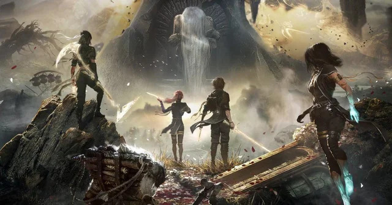

  
By KAT

  
~[N] hours

  
<strong>Developer:</strong> Sandfall Interactive

  
<strong>Publisher:</strong> Kepler Interactive

  
<strong>Released:</strong> April [DD], 2025

  
<strong>Platforms:</strong> [PC / PS5 / Xbox Series X|S]

*[One sentence that captures your personal angle on the game. Not a summary, a take.]*

[Open mid-scene, mid-thought, or mid-feeling. Start with a specific moment instead of explaining what the game is.]

[Pull back slightly and give context. What were you expecting from Clair Obscur: Expedition 33, and what did you bring into it as a player?]

* * *

[Talk about the thing that actually defined your time with the game. The system, mood, story beat, or rhythm you kept thinking about while you were away from it.]

[Let comparisons in if they help explain your perspective. Reference other RPGs, films, or personal touchstones only when they sharpen the point.]

<blockquote class="pull-quote">
  
"[A line that captures your experience in your own voice. First-person is fine.]"

</blockquote>

[Work in technical or mechanical complaints naturally where they belong in the narrative instead of isolating them in a checklist.]

<figure class="inline-img">
  
  <figcaption>[What is shown here and why this image supports the point you are making.]</figcaption>
</figure>

[Continue with what surprised you, where the game clicked, or where it lost momentum. Focus on your actual play experience.]

[A short digression is fine if it reveals something about how you engage with the game. Keep it in service of the review.]

* * *

[Start winding down by returning to the opening feeling or scene. Avoid switching into a summary voice too early.]

  
<strong>One last thing.</strong>

  

    [Write a final paragraph about who this game is for and who might bounce off it. Be specific about player taste, pacing tolerance, and what kind of RPG experience they want.]
  

